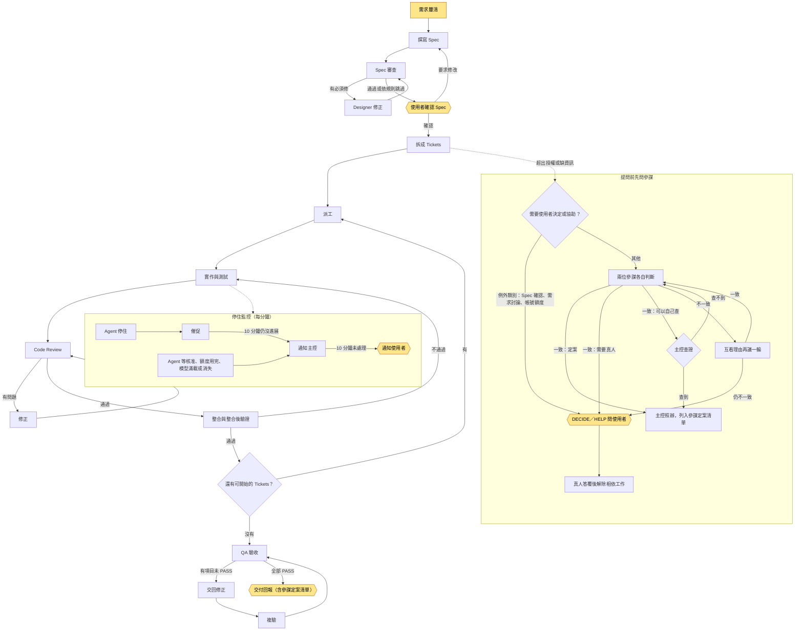

# LoopAgentTeams

整合 Matt Pocock 的 [Matt skills](https://github.com/mattpocock/skills)，面向 Claude Code、Codex 等 Coding Agent 的多 Agent 協作技能組。

Matt skills 將需求釐清、Spec、Ticket 拆分與實作拆成各自獨立的技能，每完成一段就停下，等待使用者手動確認並觸發下一段。LoopAgentTeams 以 LAT 串接這些階段：使用者確認 Spec 後，拆票、實作、Code Review、整合驗證與 QA 驗收自動銜接，無問題即持續推進；只有需求變更或超出授權的事項才回頭詢問使用者。

LoopAgentTeams 以 Agent Skills 形式發布：流程、角色分工與交接規範寫成技能指引，由支援 skills 的 Agent client 載入執行，不需額外部署服務。

## 特點

- **單一確認點，其後自主推進**：使用者確認 Spec 後，Orchestrator 在已授權範圍內完成拆票、派工、審查、修正與交付，不在每個階段交接處等待指示。
- **跨模型、跨 client 分工**：依任務性質指派模型與 effort，例如前端交給 Claude、後端交給 Codex；內建 Subagent 能套用所選模型、effort 與權限時優先使用，否則透過 [HCOM](https://github.com/aannoo/hcom) 啟動外部 Agent。
- **實作與驗收職責分離**：每張 Ticket 經獨立 Code Review；QA 依需求獨立設計測試情境，UI 驗收須透過真實介面操作。必要驗證未執行時，不宣告完成。
- **問使用者前先問參謀**：每個 LAT 主控配兩位參謀（一位 Claude、一位 Codex），唯讀、只回覆主控。主控要發出 DECIDE 或 HELP 前，先由兩位參謀各自判斷：在既有授權內能定案的事由參謀定案、主控照辦；兩位都認定需要真人，或再議一輪仍意見不一，才問使用者。參謀不能放寬授權；第一次需要時才開，在階段交界關閉、下次重開。
- **以證據為準的整合**：合併前從 Git 核對交付 commit，在整合後版本核對驗收條件與有效證據，不直接採信 Agent 的成功回報。
- **停住監控**：每個 LAT 主控帶一支背景監控（lat-watch）。Agent 有未完成工作卻閒置 10 分鐘就催促；抓出 HCOM 狀態卡在 `active` 的停住、清除擋住訊息的輸入框殘留文字（先備份）、回報停在等核准或額度用完、模型滿載的 Agent，並依 Agent → 主控 → 使用者逐層上報。任務卡列名的 Agent 連續兩輪不在 HCOM 清單或非因額度變為 `inactive` 時，通知主控一次；主控先移走任務卡再關閉 Agent 的正常收尾不會觸發。Agent 只是在等待時，以 `lat-watch wait` 聲明。
- **完整流程與輕量協作兩種入口**：完整交付使用 LAT；只需召喚另一個 Agent 查資料、實作或交叉審查時，使用 hcom-spawn。

## 工作流程



黃色節點是使用者介入點。虛線的兩個分支在 Spec 確認後的各階段都可能發生，圖中只各畫一條。

完成[安裝](#安裝)與[專案初始化](#專案初始化)後，在 Agent client 中以 LAT 發起任務：

```text
LAT，為網站加入深色模式，先和我討論需求。
```

1. **需求釐清**：Designer 透過 `/grill-with-docs` 與使用者逐項確認功能邊界與驗收條件，例如是否跟隨系統主題、是否保存使用者偏好。
2. **Spec 確認**：整理為 Spec 發布至專案的 issue tracker，由使用者確認。這是流程中唯一的正式確認點，同一版本不重複詢問。
3. **拆票與實作**：Spec 拆為帶有依賴關係的 Tickets；Orchestrator 協調共用檔案與資源後派工，各 Implementer 以獨立 context 實作（平行作業時使用獨立 worktree），完成測試後送獨立 Code Review。
4. **整合與驗收**：合併至整合分支後驗證，仍適用的同版本證據可沿用；QA 依需求與實作路徑合併的測試清單逐項判定 `PASS`／`FAIL`／`UNPROVEN`／`NOT_EXECUTED`，缺陷交回修正後複驗。
5. **交付**：回報成果版本、驗收證據、審查結果與未完成事項。

可在指令中指定模型、分工與範圍；未指定時依 [hcom-spawn 的預設](skills/local/hcom-spawn/SKILL.md#選模型與-effort)選擇模型與 effort。

輕量協作範例：

```text
用 hcom-spawn 叫一個 Codex，審查這次後端變更，只回報問題，不修改檔案。
```

## 使用者決策點

Spec 確認後，已授權範圍內的實作、修正、測試與排程由 Orchestrator 自行推進。僅在下列情況提請使用者決定，並附上授權缺口與各選項對範圍、成本或風險的影響。除了 Spec 確認題與帳號額度問題，這些事項都先經兩位參謀判斷，參謀認定需要真人才問使用者：

- 變更已確認的需求或範圍。
- 需要僅使用者能提供的資訊或操作，例如帳號、金鑰或人工設定。
- 事先保留須由使用者核准的事項。
- Codex 無可用的訂閱帳號，或 Claude 額度耗盡，須決定等待、兌換額度重置或改採替代方案。Codex 額度耗盡時會先自動切換至其他仍有額度的訂閱帳號，不切換至 API 計費帳號，也不自動兌換額度重置。

待決事項記錄於專案的 `.lat/decisions/`，只阻擋相依工作，其餘已授權工作持續進行；僅採信使用者本人的答覆，其他 Agent 轉述不視為核准。這些是技能層的流程約束，工具只在主控結束回合時核對 DECIDE（見下段），不阻擋檔案或指令。設計細節見[決策設計](docs/lat-user-decisions-design.md)。

參謀定案的事同樣留下待決紀錄，含兩位參謀的意見與引用的授權來源；參謀定案不是真人核准，引用不到已確認的 Spec 或使用者答覆就不能定案。主控不即時通知這些定案，改在批次成果與交付回報列出參謀定案清單，使用者可隨時推翻。已問過使用者的事只有使用者答覆能解除，參謀不能改判。安裝[壓縮恢復 hook](#安裝) 後，主控結束回合時若 DECIDE 的題目缺少待決紀錄、參謀結論或例外註記，會被攔下並要求補做。

## 技能組成

| 技能 | 職責 |
| --- | --- |
| [LAT](skills/local/lat/SKILL.md) | 完整交付流程：角色分工、階段轉換、派工、整合與驗收 |
| [hcom-spawn](skills/local/hcom-spawn/SKILL.md) | 透過 HCOM 召喚跨 client 的 Agent：模型與 effort 選擇、啟動核對、任務交代與收尾 |
| [three-tier-testing](skills/local/three-tier-testing/SKILL.md) | 依外部依賴將測試分為單元、整合與 E2E 三層，分開執行，區分模擬與真實服務的驗證 |

各階段的具體方法沿用 Matt Pocock 的 [Matt skills](https://github.com/mattpocock/skills)（`grill-with-docs`、`to-spec`、`to-tickets`、`implement`、`code-review` 等），LAT 負責階段銜接與角色協調。

## 安裝

需要的工具：

| 工具 | 用途 |
| --- | --- |
| Git | 版本控制；平行實作時以獨立 worktree 隔離各 Agent 的工作區 |
| Bun | 執行下方的 `bunx` 安裝指令 |
| [skills CLI](https://github.com/vercel-labs/skills) | 安裝與更新技能，以 `bunx skills` 執行 |
| Agent client（Claude Code、Codex 等） | 載入技能並執行任務 |
| [HCOM](https://github.com/aannoo/hcom) | 跨 client 的 Agent 通訊；使用 hcom-spawn 或外部 Agent 時需要 |

**1. 安裝 LoopAgentTeams 技能**（全域安裝到 Claude Code 與 Codex；使用其他 client 時調整 `--agent`）：

```bash
bunx skills add ouob-tw/LoopAgentTeams \
  --skill lat hcom-spawn three-tier-testing to-spec to-tickets implement grill-with-docs wayfinder handoff \
  --skill setup-matt-pocock-skills triage to-questionnaire \
  --global --agent claude-code codex
```

**2. 安裝其餘必要的 Matt skills：**

```bash
bunx skills add mattpocock/skills \
  --skill code-review prototype grilling domain-modeling tdd \
  --global --agent claude-code codex
```

若想安裝完整的 `Mattpocock Skills` 群組，可改用下列腳本取代第 2 步。腳本依上游清單選取技能，預設排除 `Other` 群組及本 repo 已收錄的同名技能：

```bash
uv run scripts/install-matt-skills.py
```

腳本需在[本地 clone](#本地開發) 的 repo 目錄執行，並需要 `uv`、`gh`、`bunx` 與 `trash-put`；加上 `--dry-run` 可先預覽。預設全域安裝至 Claude Code 與 Codex，使用其他 client 時加上 `--agent`。其他選項見 [skills 安裝說明](https://github.com/vercel-labs/skills#readme)。

**3. 壓縮恢復 hook**（以 Codex 或 Claude 擔任 LAT 主控時建議安裝）：

Codex 壓縮上下文後不會保留已載入的 LAT 內容；Claude 只保留每個技能的前段，LAT 後段規則與 references 會遺失。安裝此 hook 後，登記為 LAT 主控的對話在壓縮或接回時會收到短提示，先完整重讀 LAT 規則、進度與待決紀錄再繼續。需要 `uv`。

```bash
lat_dir="$HOME/.agents/skills/lat"
codex_home="${CODEX_HOME:-$HOME/.codex}"
uv run --no-project python "$lat_dir/scripts/lat-session.py" install --codex-home "$codex_home" --preview
uv run --no-project python "$lat_dir/scripts/lat-session.py" install --codex-home "$codex_home"
```

確認 preview 只新增 LAT 的 hook 後再安裝；原本的 `hooks.json` 會先備份，其他 hooks 保留。重新啟動 Codex，在 `/hooks` 的 `SessionStart` 只信任 command 結尾為 `lat-session.py hook` 的項目。Codex 更新或重設 hooks 後，再到 `/hooks` 確認它仍受信任。activate 同時啟動停住監控，須帶 `--hcom-name` 與 `--tasks`，指令見[主控恢復](skills/local/lat/references/recovery.md#主控啟動與結束)；舊版啟用的主控在接回時會收到一行升級提示。使用方式、舊版 `codex-lat-session.py` 的升級、停用遺留紀錄與移除步驟見 [LAT 壓縮後恢復](docs/lat-recovery.md)。

Claude Code 寫入使用者層級的 `~/.claude/settings.json`，不需信任步驟，重啟 Claude Code 後生效：

```bash
uv run --no-project python "$lat_dir/scripts/lat-session.py" install --client claude --preview
uv run --no-project python "$lat_dir/scripts/lat-session.py" install --client claude
```

### 專案初始化

在目標專案中執行一次 `/setup-matt-pocock-skills`，設定 issue tracker（例如 GitHub Issues）、triage 標籤與領域文件位置；LAT 依此讀寫 Spec 與 Tickets。每個專案僅需初始化一次。

若專案 repo 為公開，建議另建私人 `<repo>-work` repo 存放 issues，避免交接紀錄與驗證證據中的內網位址、本機路徑或帳號資訊外流。

## 可選工具

- **[HERDR](docs/hcom-herdr-setup.md)**：集中監看多個 Agent，包括透過 HCOM 啟動的外部 Agent，並以 workspace 整理工作視窗；整合方式見連結說明。LAT 問題面板（Herdr 外掛，`prefix+a`）以 A./B./C. 列選項、按字母鍵作答。Herdr 彈出通知經 SSH 送到外層終端機，需設定 `[ui.toast] delivery = "terminal"`；提示音在執行 Herdr client 的機器上播放，透過 SSH 時聽不到。
- **[codex-multi-auth](https://github.com/ndycode/codex-multi-auth)**：管理多個 Codex 帳號與額度，以 `codex-multi-auth switch <n>` 切換帳號；額度檢查與換帳號後接續工作的方式，見 hcom-spawn 的[額度與換帳號說明](skills/local/hcom-spawn/references/troubleshooting.md#codex-額度與換帳號)。

  ```bash
  bun add --global codex-multi-auth
  codex-multi-auth login  # 各帳號分別登入
  ```

- **[cswap（claude-swap）](https://github.com/realiti4/claude-swap#automatic-switching)**：切換 Claude Code 帳號。加入帳號並啟動自動切換後，接近額度上限時會自動換到還有額度的帳號。Linux／Windows 通常不需重啟 Claude Code；macOS 須等待 Keychain 快取更新。需先安裝 [uv](https://docs.astral.sh/uv/getting-started/installation/)：

  ```bash
  uv tool install claude-swap
  cswap add   # 每次登入不同 Claude Code 帳號後執行
  cswap auto  # 保持執行，自動監看與切換
  ```

## 文件

- [LAT 流程與規則](skills/local/lat/SKILL.md)
- [LAT 停住監控](skills/local/lat/references/stall-watch.md)、[設計取捨](docs/adr/0001-lat-stall-watcher.md)
- [LAT 的派工與收尾規則](skills/local/lat/references/agents.md)
- [hcom-spawn：召喚 Agent 協作](skills/local/hcom-spawn/SKILL.md)
- [三層測試](skills/local/three-tier-testing/SKILL.md)
- [HCOM／HERDR workspace 設定](docs/hcom-herdr-setup.md)
- [LAT 壓縮後恢復：安裝與使用](docs/lat-recovery.md)

## 本地開發

技能原始檔依來源分成 `skills/local/`（LAT、hcom-spawn、three-tier-testing）與 `skills/matt/`（Matt skills 副本）。

本 repo 收錄的九個 Matt skills 副本，移除了 `disable-model-invocation` 並啟用 Codex 的 `allow_implicit_invocation`，讓 LAT 能自動呼叫各階段技能，因此不能直接換成上游原版。副本來源為上游 main `d81f3a1`（內容等同待發布的 v1.3.0）；更新時優先採用正式發布版，正式版落後時採用已準備發布的版本並記錄 commit。

首次下載（已有本地工作區可略過）：

```bash
git clone https://github.com/ouob-tw/LoopAgentTeams.git ~/LoopAgentTeams
```

修改後同步安裝到 Claude Code 與 Codex（可重複執行）：

```bash
bunx skills add ~/LoopAgentTeams \
  --skill lat hcom-spawn three-tier-testing to-spec to-tickets implement grill-with-docs wayfinder handoff \
  --skill setup-matt-pocock-skills triage to-questionnaire --global \
  --agent claude-code codex --yes
```

## 授權

[MIT](LICENSE)
